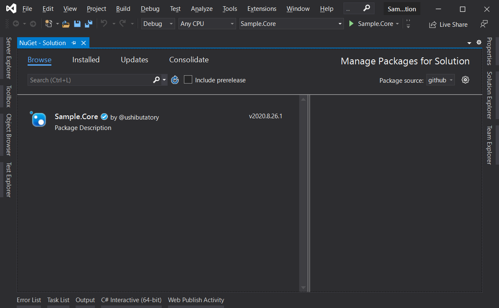

# sample-publish-nuget_package

GitHub PackagesをプライベートなNuGetパッケージソースとして利用する。

## 概要

自作NuGetパッケージをGitHubPackagesに配置することで、プライベートなNuGetパッケージソースとして扱うことができます。

nuget.orgへ公開したくない、チーム内や個人で共有したいパッケージの管理方法のひとつとして有効だと思います。


## 詳細

### Code

クラスライブラリとして作成します。
一般的なNuGetパッケージと同様なので割愛します。


### Actions

[.github/workflows/publish.yml](.github/workflows/publish.yml)

```yml
on:
  push:
    tags:
      - ver.*
```

- トリガーはお好みで設定してください。

```yml
- name: Setup
  uses: actions/setup-dotnet@v1
  with:
    source-url: "https://nuget.pkg.github.com/${USER_NAME}/index.json"
  env:
    USER_NAME: ushibutatory
    NUGET_AUTH_TOKEN: ${{secrets.GITHUB_TOKEN}}
```

- 発行先のリポジトリを指定します。
- 発行用のトークンは `GITHUB_TOKEN` を使用します。

```yml
- name: Build and Test
  run: |
    ...
    dotnet build -c Release
    dotnet test -c Release --no-build
- name: Pack and Publish
  run: |
    ...
    dotnet pack -c Release --no-build -o .
    dotnet nuget push *.nupkg
```

- `dotnet nuget push` コマンドにより、生成したパッケージを発行します。発行先は先に指定した自身のリポジトリ（GitHub Packages）です。
- Build、Test、Pack、Publish(nuget push)は、お好みの単位で区切ります。

### ローカルからの参照

`NuGet.Config`にGitHubのリポジトリを追加します。

- 参考: [GitHub Packages への認証を行う](https://docs.github.com/ja/packages/using-github-packages-with-your-projects-ecosystem/configuring-dotnet-cli-for-use-with-github-packages#)

プロジェクトディレクトリにnuget.configを作成する、または下記の共通configを編集します。

`%USERPROFILE%AppData\Roaming\NuGet\NuGet.config`

```xml
<configuration>
    <packageSources>
        ...
        <add key="github" value="https://nuget.pkg.github.com/OWNER/index.json" />
        ...
    </packageSources>
    <packageSourceCredentials>
        <github>
            <add key="Username" value="USERNAME" />
            <add key="ClearTextPassword" value="TOKEN" />
        </github>
    </packageSourceCredentials>
</configuration>
```

`ClearTextPassword` に設定するトークンの取得方法は下記を参照してください。

- 参考: [個人アクセストークンを使用する](https://docs.github.com/ja/github/authenticating-to-github/creating-a-personal-access-token)
- 付与する権限（scope）は以下の通りです。
    - `read:packages`

正しく設定されると、NuGetパッケージマネージャから発行したパッケージが参照・利用できるようになります。



## 課題・懸念

Publicリポジトリのパッケージであっても、上記の個人アクセストークンの設定、及び `NuGet.config` は必要なようです。
主な利用用途は「Privateリポジトリで管理している一般公開しないパッケージの共有」を想定しているので問題ないかと思いますが、もし nuget.org ではなくGitHubPackagesで自作NuGetパッケージを一般配布したい、という要求があった場合、もう少し設定などが必要かもしれません（予定はないので検証していません）。

## 参考

- [GitHub Packagesで利用するためにdotnet CLIを設定する](https://docs.github.com/ja/packages/using-github-packages-with-your-projects-ecosystem/configuring-dotnet-cli-for-use-with-github-packages)
